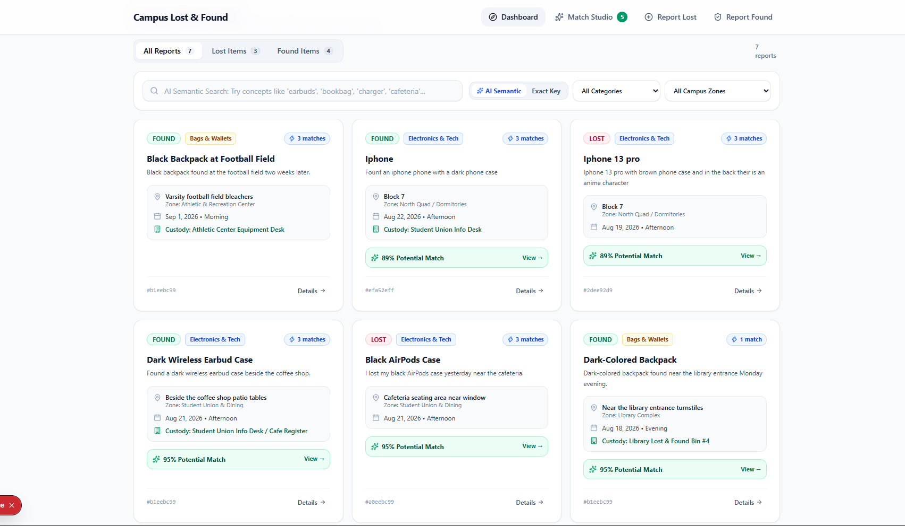
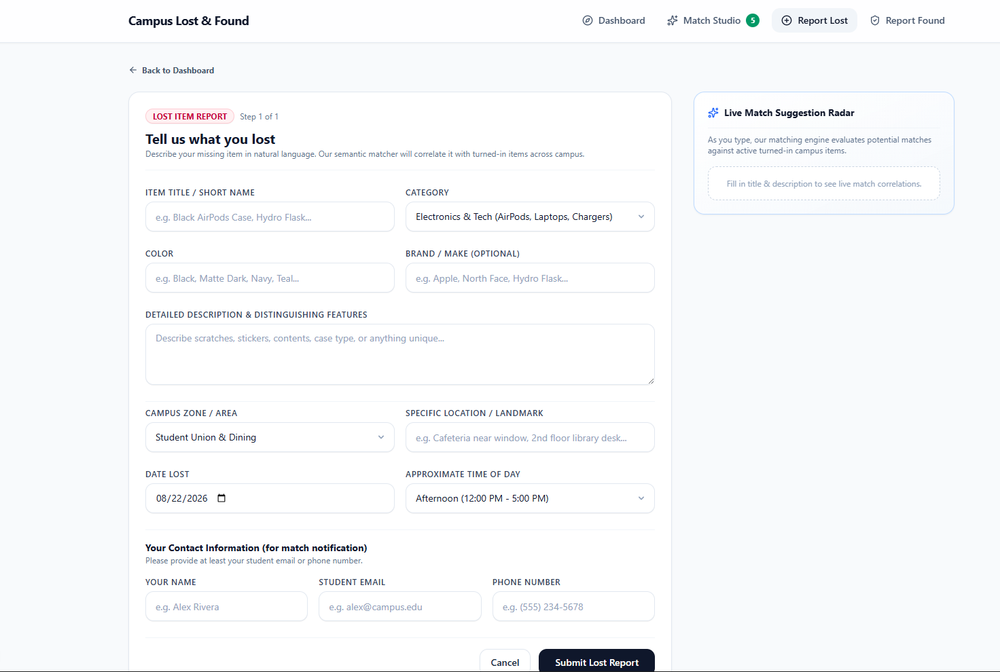
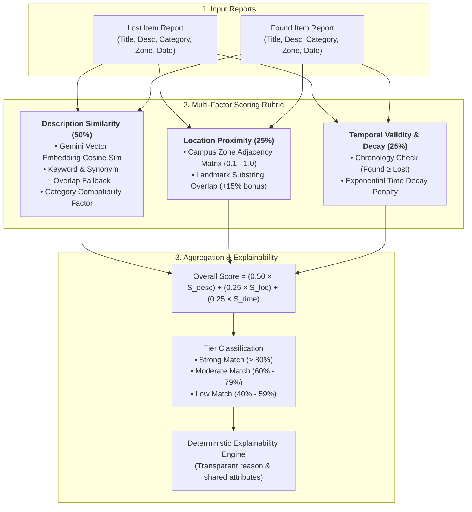
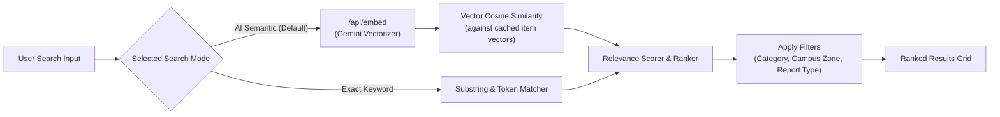
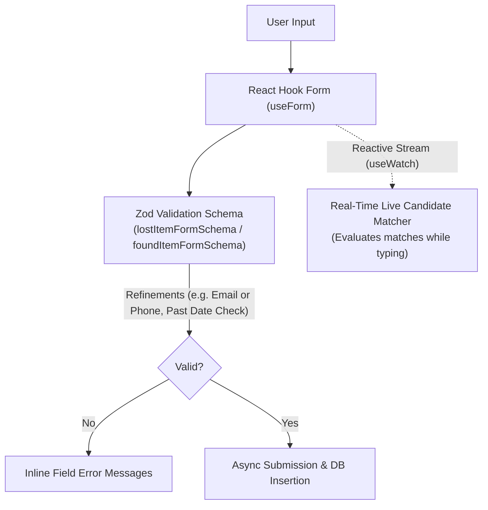

# Campus Lost & Found Matcher

An intelligent, full-stack Lost & Found reconciliation system designed for university campuses. It automatically identifies, scores, and explains potential matches between lost and found item reports using multi-factor heuristics and AI semantic embeddings.

---

## 📸 Screenshots & UI Preview

### 1. Dashboard & Hybrid AI Semantic Search
Browse lost/found inventory with real-time match badges, category filters, and natural language semantic search.



### 2. Report Submission & Real-Time Live Match Radar
Reactive form validation powered by React Hook Form & Zod, streaming instant candidate match suggestions in the sidebar as you type.



---

## Quick Start

### 1. Prerequisites

- **Node.js**: v18.18+ or v20+
- **npm** (or pnpm / yarn / bun)

### 2. Installation & Setup

```bash
npm install
cp .env.example .env.local
```

### 3. Configure `.env.local`

```env
DATABASE_URL="sqlite.db"
GEMINI_API_KEY="your_gemini_api_key_here"
```

### 4. Run the Application

```bash
npm run dev
```

Open [http://localhost:3000](http://localhost:3000) in your browser. The SQLite database automatically initializes and seeds with realistic campus test cases on first run.

---

## 1. Approach Taken

When analyzing the assessment scenario, it was immediately clear that **search intelligence and matching accuracy** were the primary engineering challenges. While initial thoughts on first glance suggested regex, category tagging, and fuzzy string distance, ambiguous real-world prompt examples (_"black AirPods case"_ vs. _"dark wireless earbud case"_, or _"backpack containing laptop charger"_ vs. _"dark-colored backpack"_) made it evident that keyword matching alone is insufficient.

To solve this effectively within the assessment timeframe, the following approach was taken:

1. **Hybrid Vector & Multi-Factor Matching**: Implemented dense vector embeddings (`gemini-embedding-001` with cosine similarity) blended with physical campus heuristics (spatial proximity matrices, chronological decay penalties, category compatibility).
2. **Focused Engineering over Boilerplate**: Chose a zero-config, embedded SQLite database via Drizzle ORM rather than spending valuable time setting up dockerized PostgreSQL, Supabase instances, or complex auth plumbing. This allowed 100% focus on the core domain logic: matching, scoring, explainability, and live real-time candidate search.
3. **Graceful Offline Fallback**: Designed the system with a dual pipeline—if an API key is absent or network requests fail, it gracefully falls back to a curated semantic token and synonym dictionary without breaking functionality.

### Development Timeline & Iterative Process

- **Hours 0 – 3 (Architecture, UI & Baseline Heuristic Matching)**:
  - Designed the core approach, stress-tested assumptions, and set up the foundation.
  - Implemented the UI and core reporting flows.
  - Built the baseline multi-factor matching engine using fuzzy keyword matching, category compatibility, location proximity matrices, and temporal chronology (without embeddings at this stage).
- **Hours 3 – 4 (Vector Embeddings & Hybrid Search Elevation)**:
  - Integrated dense vector embeddings (`gemini-embedding-001`) to significantly elevate semantic matching accuracy for ambiguous items.
  - Implemented the hybrid search bar, debounced query vectorization, and fallback mechanisms.

---

## 2. System Architecture & Matching Engine



### Matching Rubrics & Scoring Formula

Every candidate pair is evaluated on a composite **0 to 100 score**:

$$\text{Overall Score} = (0.50 \times S_{\text{desc}}) + (0.25 \times S_{\text{loc}}) + (0.25 \times S_{\text{time}})$$

#### 1. Description Similarity ($S_{\text{desc}}$ — 50% Weight)

- **AI Vector Embeddings**: Evaluates Google Gemini `gemini-embedding-001` vectors via cosine similarity ($85\%$) + category compatibility factor ($15\%$).
- **Synonym & Token Fallback**: If vector embeddings are offline, text is tokenized, stripped of stop words, and evaluated against a synonym dictionary (_AirPods $\leftrightarrow$ earbuds, backpack $\leftrightarrow$ bag, dark $\leftrightarrow$ black_).
- **Category Factor**: Exact match ($1.0$), generic/other ($0.7$), distinct mismatch ($0.1$).

#### 2. Location Proximity ($S_{\text{loc}}$ — 25% Weight)

- **Campus Zone Proximity Matrix**:
  - **Identical Zone** (_Library Complex $\leftrightarrow$ Library Complex_): `1.0`
  - **Adjacent / Connected Zones** (_Student Union $\leftrightarrow$ Campus Green_): `0.85 – 0.90`
  - **Moderate Distance** (_Science Quad $\leftrightarrow$ Dorms_): `0.40 – 0.60`
  - **Distant / Off-Campus**: `0.10 – 0.25`
- **Landmark Substring Bonus**: $+15\%$ score boost when specific building room/hall names overlap.

#### 3. Temporal Validity & Decay ($S_{\text{time}}$ — 25% Weight)

- **Chronology Hard Constraint**: Items cannot be found days before they were lost. If `found_date < lost_date` (allowing a 2-hour grace margin for reporting errors), the score receives a severe penalty.
- **Time Decay Curve**:
  - Same day / within hours: `100%`
  - 1–2 days later: `90%`
  - 3–5 days later: `75%`
  - ~1 week later: `50%`
  - 2–3 weeks later: `25%`
  - > 1 month later: `10%`

#### 4. Deterministic Explainability (Zero Hallucination)

Rather than calling an LLM for match explanations (which introduces cost, latency, and hallucination risks), the engine utilizes a **deterministic phrase-assembly pipeline**. It outputs structured, factual justifications (_e.g., "Strong Match (88%): Strong semantic match between AirPods and wireless earbud case, same campus area (Student Union), found within hours of loss"_).

---

## 3. Hybrid Search Architecture

The search interface supports both **AI Semantic Search** and **Exact Keyword Search**:



---

## 4. Form Validation & State Management (React Hook Form + Zod)

All student and staff reporting workflows are powered by **React Hook Form** combined with **Zod** schema validation (`@hookform/resolvers/zod`):



- **Declarative Schema Validation (`src/lib/schemas/item-form-schema.ts`)**:
  - **Date Constraints (`itemDateSchema`)**: Enforces calendar validity, disallows future dates, and caps past dates at 1 year.
  - **Flexible Contact Resolution (`superRefine`)**: Ensures at least one valid notification channel (email or phone) is provided for lost reports.
  - **Custody Location Enforcement**: Mandates physical holding desk specifications for found items.
- **Real-Time Match Streaming (`useWatch`)**: Reactively streams form field values to `findLiveMatchesForDraft()` without triggering full page re-renders, displaying live match candidates in the radar sidebar before the user submits the form.

---

## 5. Major Technical Decisions

| Decision                                           | Rationale                                                                                                                                |
| :------------------------------------------------- | :--------------------------------------------------------------------------------------------------------------------------------------- |
| **Next.js 15 App Router + React 19**               | Fast server rendering, unified API route handlers, modern React state handling.                                                          |
| **SQLite + Drizzle ORM**                           | Zero-dependency local persistence (`sqlite.db`) with full type safety and effortless setup without running external database containers. |
| **React Hook Form + Zod**                          | High-performance, un-opinionated form state with zero unnecessary re-renders and schema-driven runtime validation.                       |
| **Centralized Constants (`src/lib/constants.ts`)** | Single source of truth for campus zones, categories, filter dropdowns, holding locations, and demo presets.                              |
| **Dual Matching Pipeline (Embeddings + Fallback)** | Guarantees high matching accuracy with Gemini AI vectors while maintaining $100\%$ functionality offline or without an API key.          |
| **Real-Time Live Candidate Matcher**               | Evaluates potential matches as the student types in the report form, providing instant feedback before submission.                       |
| **Deterministic Rule Assembly for Explanations**   | Eliminates LLM latency, eliminates API costs, and prevents hallucinations in match justifications.                                       |

---

## 6. Important Assumptions Made

1. **Evaluation Focus**: Assumed that matching quality, algorithmic intelligence, explainability, and search accuracy hold the primary weight in assessing technical competence.
2. **Campus Zone Geography**: Real university campuses have distinct walkable zones with predictable foot traffic between adjacent buildings.
3. **Chronological Precedence**: Items are typically found at the same time or after they are reported lost.
4. **Imperfect Student Descriptions**: Reports often omit brands, use colloquial terms (_"earbuds"_ instead of _"Apple AirPods Pro"_), or estimate times. The system is tolerant to partial or missing attributes.
5. **Staff Review Workflow**: Automatic matching surfaces ranked candidates to campus staff or students; final item handover/custody resolution remains a human verification step.

---

## 7. Intentionally Out of Scope (Chosen Not to Build)

To keep the scope focused on solving the core matching problem effectively within the time limit:

- **User Authentication / SSO**: No student login or OAuth flows; reports support optional contact info or anonymous filing.
- **Automated Email / SMS Notifications**: Matches are displayed in the dashboard rather than dispatched via external messaging webhooks.
- **Image Computer Vision Uploads**: Focus was placed on robust text/metadata vectorization and spatial-temporal heuristics.

---

## 8. Future Improvements for a Production System

If transitioning this prototype into a full enterprise-grade university product, the following architecture would be implemented:

1. **Full Authentication & Role-Based Access Control**: Integration with university SSO (SAML/OAuth2) with distinct student, campus police, and desk staff roles.
2. **PostgreSQL with Row-Level Security (RLS)**: Enforce database-level access policies so contact details and private item claims are only accessible by authorized roles.
3. **Dedicated Backend with `pgvector`**: Separate core services into a FastAPI / Node.js backend with PostgreSQL and `pgvector` for scalable vector persistence.
4. **HNSW Indexing for Vectors**: Implement **Hierarchical Navigable Small World (HNSW)** indexes to enable millisecond approximate nearest neighbor ($k$-NN) updates dynamically as items are logged or modified, eliminating the need to rebuild index graphs from scratch.
5. **Asynchronous Background Embedding Worker**: Offload vector embedding generation to a background queue (e.g. BullMQ / Celery) with automated retries, rate-limiting handlers, and dead-letter queues to guarantee report persistence even during external API downtime.
6. **In-App Messaging & Threaded Item Comments**: Direct chat channel between the finder/desk custodian and claimant to facilitate secure item verification, alongside public staff notes on item custody.
7. **Multimodal Vision Matching**: Incorporate vision models (e.g. CLIP / Gemini Vision) to match item photographs directly against lost descriptions.

---

## 9. AI Usage Disclosure

In compliance with the assessment guidelines:

- **Antigravity / Gemini Assistant**: Used Antigravity as the primary development agent. Most of the UI boilerplate and component layouts were generated with Gemini/Antigravity to avoid spending excessive time manually styling and to maintain focus on the core search and matching algorithms.
- **Claude (Anthropic)**: Used for initial brainstorming, solidifying assumptions, stress-testing edge cases (such as time decay logic and inverted chronology penalties), and finalizing the architectural approach.
- **Previous Domain Experience**: Heavy architectural inspiration was drawn from previous hands-on implementations of hybrid search systems and vector reconciliation pipelines.
